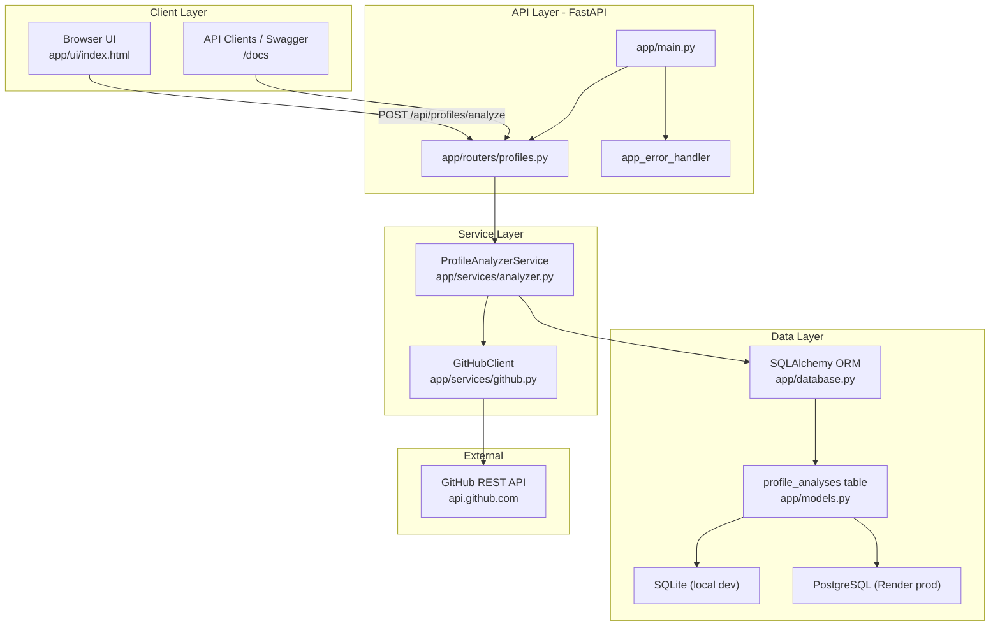
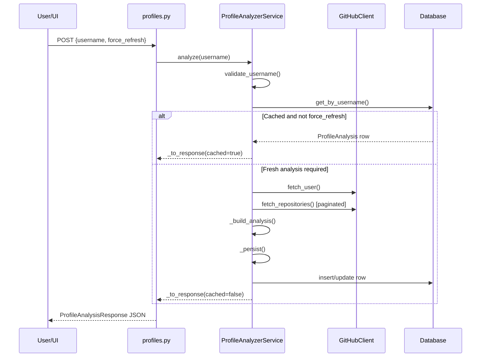

# GitAnalyse

GitAnalyse is a full-stack GitHub profile intelligence service. It accepts a public GitHub username, fetches profile and repository data from the GitHub REST API, computes structured metrics and human-readable insights, caches results in a database, and serves both a REST API and a simple browser UI.

Repository: [https://github.com/asitgiri1234/gitanalyse](https://github.com/asitgiri1234/gitanalyse)

---

## Table of contents

1. [What this project does](#what-this-project-does)
2. [Engineering architecture](#engineering-architecture)
3. [Technology stack](#technology-stack)
4. [End-to-end request flow](#end-to-end-request-flow)
5. [Project structure](#project-structure)
6. [Module and function reference](#module-and-function-reference)
7. [Data model and persistence](#data-model-and-persistence)
8. [Analysis engine details](#analysis-engine-details)
9. [API reference](#api-reference)
10. [Web UI](#web-ui)
11. [Error handling](#error-handling)
12. [Configuration](#configuration)
13. [Local development](#local-development)
14. [Production deployment (Render)](#production-deployment-render)
15. [Security notes](#security-notes)

---

## What this project does

| Capability | Description |
|------------|-------------|
| Profile analysis | Collects username, bio, followers, following, public repo count, join date, account age |
| Repository analytics | Aggregates stars, forks, language usage, fork ratio, activity windows |
| Domain intelligence | Classifies engineering focus (web, backend, data/AI, DevOps, mobile, security) |
| Repo quality signals | Measures documentation/license/homepage/wiki/topic coverage and per-repo quality score |
| Insight generation | Produces categorized narrative insights (tenure, impact, activity, portfolio, etc.) |
| Cache layer | Stores analysis in DB; repeat requests skip GitHub unless `force_refresh=true` |
| Simple UI | Single-page app at `/` for username input and structured result display |

---

## Engineering architecture

GitAnalyse follows a layered architecture: **presentation (FastAPI routes + static UI) → application services → external GitHub API + SQL database**.



### Design principles

- **Cache-first reads**: `POST /analyze` checks DB before calling GitHub.
- **Separation of concerns**: routing, validation/schemas, GitHub I/O, analytics, and persistence are isolated.
- **JSON blobs for extensibility**: complex structures (`repository_stats`, `insights`, `top_repositories`) are stored as JSON text columns to avoid frequent schema migrations.
- **Environment-driven config**: tokens and DB URLs come from environment variables via `pydantic-settings`.
- **Graceful degradation**: invalid usernames, missing users, rate limits, and network failures map to structured API errors.

---

## Technology stack

| Layer | Technology | Role |
|-------|------------|------|
| Web framework | FastAPI | HTTP API, OpenAPI docs, lifespan hooks |
| ASGI server | Uvicorn | Local and production process server |
| HTTP client | httpx (async) | GitHub API calls |
| ORM | SQLAlchemy 2.x | Models, sessions, engine |
| Validation | Pydantic v2 | Request/response schemas |
| Settings | pydantic-settings | `.env` + environment variable loading |
| DB (local) | SQLite | Default developer cache DB |
| DB (prod) | PostgreSQL + psycopg | Render-managed persistent cache |
| Frontend | Vanilla HTML/CSS/JS | No separate frontend build pipeline |
| Deployment | Render Blueprint (`render.yaml`) + `Procfile` | Web service + Postgres |

---

## End-to-end request flow

### Analyze username (`POST /api/profiles/analyze`)



### Read cached profile (`GET /api/profiles/{username}`)

1. Validates username format.
2. Loads row from DB via `get_by_username()`.
3. If missing, raises `AnalysisNotFoundError` (404).
4. Converts DB row to API response via `_to_response(cached=true)`.

---

## Project structure

```
gitanalyse/
├── app/
│   ├── main.py                 # App bootstrap, lifespan, routes, error handler, UI root
│   ├── config.py               # Environment-backed settings
│   ├── database.py             # Engine/session setup, DB URL normalization
│   ├── models.py               # SQLAlchemy ProfileAnalysis model
│   ├── schemas.py              # Pydantic API contracts
│   ├── exceptions.py           # Domain-specific HTTP errors
│   ├── routers/
│   │   └── profiles.py         # Profile API endpoints
│   ├── services/
│   │   ├── github.py           # GitHub API client + username validation
│   │   └── analyzer.py         # Analytics engine + persistence orchestration
│   └── ui/
│       └── index.html          # Browser UI (structured output renderer)
├── data/                       # Local SQLite files (gitignored)
├── render.yaml                 # Render blueprint (web + postgres)
├── Procfile                    # Process start command
├── requirements.txt            # Python dependencies
├── .env.example                # Environment variable template
└── README.md                   # Project documentation
```

---

## Module and function reference

### `app/main.py` — application entrypoint

| Function | Purpose |
|----------|---------|
| `lifespan()` | FastAPI lifespan hook; calls `init_db()` on startup to ensure tables exist |
| `app_error_handler()` | Converts `AppError` subclasses into JSON error responses |
| `health()` | Liveness endpoint (`GET /health`) used by Render health checks |
| `root()` | Serves `app/ui/index.html` if present, else inline fallback HTML |
| `root_index()` | Alias route for `/index.html` |

### `app/config.py` — configuration

| Symbol | Purpose |
|--------|---------|
| `Settings` | Loads `GITHUB_TOKEN`, `DATABASE_URL`, API base URL, timeout from env |
| `settings` | Singleton settings instance used across modules |

### `app/database.py` — database infrastructure

| Function | Purpose |
|----------|---------|
| `_normalize_database_url()` | Converts Render `postgres://` URLs to SQLAlchemy `postgresql+psycopg://` |
| `_ensure_sqlite_dir()` | Creates local `./data` directory for SQLite file DB |
| `get_db()` | FastAPI dependency that yields/closes SQLAlchemy sessions per request |
| `init_db()` | Creates tables from SQLAlchemy models at startup |

### `app/models.py` — persistence model

| Model | Purpose |
|-------|---------|
| `ProfileAnalysis` | One row per analyzed username; stores scalar metrics + JSON blobs |

Unique constraint: `username` (enforces one cached profile per user).

### `app/schemas.py` — API contracts

| Model | Purpose |
|-------|---------|
| `RepositorySummary` | Per-repo summary including quality and topic metadata |
| `RepositoryStats` | Aggregated repository metrics + domain intelligence fields |
| `MostStarredRepository` | Top starred repository details |
| `ProfileInsight` | Generated insight card (`category`, `title`, `description`, `severity`) |
| `ProfileAnalysisResponse` | Full analysis payload returned by API |
| `ProfileListItem` | Compact item for list endpoint |
| `ProfileListResponse` | List wrapper with `total` |
| `AnalyzeRequest` | Input body for analyze endpoint |
| `ErrorResponse` | Standardized API error body |

### `app/exceptions.py` — domain errors

| Exception | HTTP | `error_code` | When raised |
|-----------|------|--------------|-------------|
| `InvalidUsernameError` | 400 | `invalid_username` | Username format fails validation |
| `ProfileNotFoundError` | 404 | `profile_not_found` | GitHub user does not exist |
| `AnalysisNotFoundError` | 404 | `analysis_not_found` | GET profile requested before analyze |
| `RateLimitError` | 503 | `rate_limit_exceeded` | GitHub rate limit exhausted |
| `GitHubAPIError` | 502 | `github_api_error` | Timeout/network/non-404 GitHub failures |

### `app/routers/profiles.py` — HTTP routes

| Function | Endpoint | Purpose |
|----------|----------|---------|
| `_service()` | dependency | Builds `ProfileAnalyzerService` with DB session |
| `analyze_profile()` | `POST /api/profiles/analyze` | Main analyze + cache workflow |
| `list_profiles()` | `GET /api/profiles` | Returns all cached analyses (summary) |
| `get_profile()` | `GET /api/profiles/{username}` | Returns one cached analysis |

### `app/services/github.py` — GitHub integration

| Function | Purpose |
|----------|---------|
| `validate_username()` | Normalizes `@username`, enforces GitHub username regex and length |
| `GitHubClient.__init__()` | Sets API headers, optional bearer token, timeout |
| `GitHubClient._request()` | Shared GET logic with timeout, 404, 403 rate-limit, and error handling |
| `GitHubClient.fetch_user()` | Calls `GET /users/{username}` |
| `GitHubClient.fetch_repositories()` | Paginates `GET /users/{username}/repos` (100/page, sorted by updated) |

GitHub preview header is enabled to improve topic metadata availability:
`Accept: application/vnd.github+json, application/vnd.github.mercy-preview+json`

### `app/services/analyzer.py` — analytics engine

#### Public service methods

| Method | Purpose |
|--------|---------|
| `ProfileAnalyzerService.analyze()` | Cache-first orchestration: validate → DB lookup → GitHub fetch → analyze → persist |
| `ProfileAnalyzerService.get_analysis()` | Reads cached analysis only (no GitHub call) |
| `ProfileAnalyzerService.list_all()` | Lists cached profiles sorted by `analyzed_at` desc |
| `ProfileAnalyzerService.get_by_username()` | Internal DB lookup helper |

#### Internal analytics helpers

| Function | Purpose |
|----------|---------|
| `_parse_dt()` | Parses GitHub ISO timestamps into timezone-aware `datetime` |
| `_days_between()` | Computes day delta between two datetimes |
| `_build_analysis()` | Main analytics pipeline: metrics, stats, insights, top repos |
| `_repo_summary()` | Converts raw GitHub repo JSON into `RepositorySummary` + `quality_score` |
| `_build_repo_quality_summary()` | Aggregates license/description/homepage/wiki/topic/stale/issue metrics |
| `_build_domain_analysis()` | Computes `primary_domain`, confidence, and weighted domain breakdown |
| `_generate_insights()` | Builds human-readable insight objects across multiple categories |
| `_persist()` | Inserts or updates `ProfileAnalysis` row (upsert by username) |
| `_to_response()` | Maps DB model to `ProfileAnalysisResponse`, sets `cached` flag |

#### Domain intelligence constants

- `DOMAIN_KEYWORDS`: keyword sets for domains (`web_development`, `backend_api`, `data_ai`, `devops_cloud`, `mobile`, `security`)
- `LANGUAGE_DOMAIN_HINTS`: maps languages (e.g., Python → `data_ai`, TypeScript → `web_development`)

Domain scoring combines:
1. Language frequency weights
2. Repo text corpus keyword matches (name, description, topics, homepage)
3. Star-weighted repo influence

#### Repository quality scoring

Per-repo `quality_score` (0–100) is derived from:
- presence of description, license, homepage, wiki, topics
- popularity signals (stars, watchers/forks)
- penalty for high open issue count

---

## Data model and persistence

### Table: `profile_analyses`

| Column group | Examples | Storage style |
|--------------|----------|---------------|
| Identity | `username` (unique), `name`, `bio` | Scalar columns |
| Social | `followers_count`, `following_count`, `public_repo_count` | Scalar columns |
| Timeline | `joined_at`, `account_age_days`, `analyzed_at` | Datetime/int columns |
| Impact | `total_stars_received`, `total_forks_received`, `total_watchers` | Scalar columns |
| Top repo | `most_starred_repo_name`, `most_starred_repo_stars`, `most_starred_repo_url` | Scalar columns |
| Rich analysis | `repository_stats_json`, `language_breakdown_json`, `insights_json`, `top_repositories_json` | JSON text |

### Cache behavior

- First analyze: GitHub fetch + compute + DB write (`cached=false` in response).
- Subsequent analyze (same username): DB read only (`cached=true`) unless `force_refresh=true`.
- `GET /api/profiles/{username}` always reads DB only.

---

## Analysis engine details

### 1) Core profile metrics

Derived from `GET /users/{username}`:
- followers, following, public repo count
- account age from `created_at`
- profile metadata (name, bio, location, company, blog, avatar)

### 2) Repository statistics

Derived from all public repositories:
- total/original/forked repo counts and fork ratio
- average/median stars per repo
- language count and primary language
- recent activity windows (90-day updates, 365-day creations)

### 3) Language and domain intelligence

Outputs:
- `repository_stats.primary_domain`
- `repository_stats.domain_confidence_percent`
- `repository_stats.domain_breakdown`

Insight category: `domain_intelligence`

### 4) Repository quality signals

Outputs:
- coverage percentages (license, description, homepage, wiki, topics)
- stale repo count (>180 days since last push)
- average open issues per repo
- per-repo `quality_score` in `top_repositories`

Insight category: `repo_quality`

### 5) Generated insights

Possible categories include:
`tenure`, `impact`, `community`, `portfolio`, `technology`, `velocity`, `activity`, `domain_intelligence`, `repo_quality`, `profile`

Each insight includes `severity`: `info`, `positive`, `neutral`, or `caution`.

---

## API reference

| Method | Path | Description |
|--------|------|-------------|
| `GET` | `/` | Web UI |
| `GET` | `/health` | Health check |
| `GET` | `/docs` | Swagger UI (auto-generated) |
| `POST` | `/api/profiles/analyze` | Analyze username (cache-first) |
| `GET` | `/api/profiles` | List cached profiles |
| `GET` | `/api/profiles/{username}` | Get one cached profile |

### Analyze request

```json
{
  "username": "asitgiri1234",
  "force_refresh": false
}
```

### Analyze response (key fields)

```json
{
  "username": "asitgiri1234",
  "followers_count": 10,
  "following_count": 5,
  "public_repo_count": 12,
  "total_stars_received": 42,
  "repository_stats": {
    "primary_domain": "backend_api",
    "domain_confidence_percent": 62.5,
    "repositories_with_license_percent": 75.0
  },
  "insights": [
    {
      "category": "domain_intelligence",
      "title": "Domain specialization",
      "description": "..."
    }
  ],
  "cached": false,
  "analyzed_at": "2026-06-02T12:00:00Z"
}
```

### Example commands

```bash
# Analyze (cache-aware)
curl -X POST http://127.0.0.1:8000/api/profiles/analyze \
  -H "Content-Type: application/json" \
  -d "{\"username\":\"torvalds\"}"

# Force refresh from GitHub
curl -X POST http://127.0.0.1:8000/api/profiles/analyze \
  -H "Content-Type: application/json" \
  -d "{\"username\":\"torvalds\",\"force_refresh\":true}"

# Read cached analysis
curl http://127.0.0.1:8000/api/profiles/torvalds
```

---

## Web UI

File: `app/ui/index.html`

Frontend behavior:
1. User enters username and clicks **Analyze**.
2. UI sends `POST /api/profiles/analyze`.
3. Response is rendered into structured sections:
   - Profile Overview
   - Impact Metrics
   - Repository Statistics (including quality coverage)
   - Language and Domain Intelligence
   - Top Languages
   - Top Repositories (with quality score)
   - Insights
4. Optional expandable **Raw JSON** panel for debugging.

UI status messaging:
- success + cache source (`Returned from DB cache` vs `Fetched from GitHub + cached`)
- readable API error messages for invalid usernames and failures

---

## Error handling

All domain exceptions inherit from `AppError` and are converted by `app_error_handler()` into:

```json
{
  "detail": "Human-readable message",
  "error_code": "machine_readable_code",
  "extra": { "username": "..." }
}
```

This keeps frontend and API consumers consistent across local and production environments.

---

## Configuration

| Variable | Default | Description |
|----------|---------|-------------|
| `GITHUB_TOKEN` | empty | GitHub PAT for higher rate limits (recommended in prod) |
| `DATABASE_URL` | `sqlite:///./data/gitanalyse.db` | SQLAlchemy DB URL |
| `github_api_base` | `https://api.github.com` | Override GitHub API host (via settings class) |
| `request_timeout` | `30.0` | GitHub HTTP timeout seconds |

Copy template:

```bash
copy .env.example .env
```

---

## Local development

```bash
python -m venv .venv
.venv\Scripts\activate
pip install -r requirements.txt
copy .env.example .env
uvicorn app.main:app --reload
```

Open:
- UI: [http://127.0.0.1:8000/](http://127.0.0.1:8000/)
- Docs: [http://127.0.0.1:8000/docs](http://127.0.0.1:8000/docs)
- Health: [http://127.0.0.1:8000/health](http://127.0.0.1:8000/health)

---

## Production deployment (Render)

This repo includes:
- `render.yaml` (Blueprint for web service + PostgreSQL)
- `Procfile` (`uvicorn app.main:app --host 0.0.0.0 --port $PORT`)

### Render services

| Service | Name | Purpose |
|---------|------|---------|
| Web Service | `gitanalyse-api` | Runs FastAPI app |
| PostgreSQL | `gitanalyse-db` | Persistent cache storage |

### Deployment steps

1. Push latest `main` branch to GitHub.
2. In Render: **New + → Blueprint** → select this repo.
3. Set `GITHUB_TOKEN` in `gitanalyse-api` environment variables.
4. Deploy and verify:
   - `GET /health` → `{"status":"ok"}`
   - open `/` and analyze a username
   - re-run same username and confirm `cached: true`

### Render commands (preconfigured)

- Build: `pip install -r requirements.txt`
- Start: `uvicorn app.main:app --host 0.0.0.0 --port $PORT`
- Health check path: `/health`

---

## Security notes

- Never commit `.env` or PAT tokens (`.env` is gitignored).
- Store secrets only in Render environment variables.
- Rotate `GITHUB_TOKEN` if exposed.
- Use least-privilege GitHub token scopes (public repo read is sufficient for this app).
- Consider adding API auth/rate limiting before exposing publicly at scale.

---

## Maintainer checklist

When extending GitAnalyse:

1. Add/modify analytics in `app/services/analyzer.py`.
2. Update response contracts in `app/schemas.py`.
3. Persist new fields in `app/models.py` + `_persist()` / `_to_response()`.
4. Expose via router if new endpoint is needed.
5. Update UI renderer in `app/ui/index.html`.
6. Validate with `/docs`, UI, and one forced refresh (`force_refresh=true`).

---

## License

Add project license here if needed.
